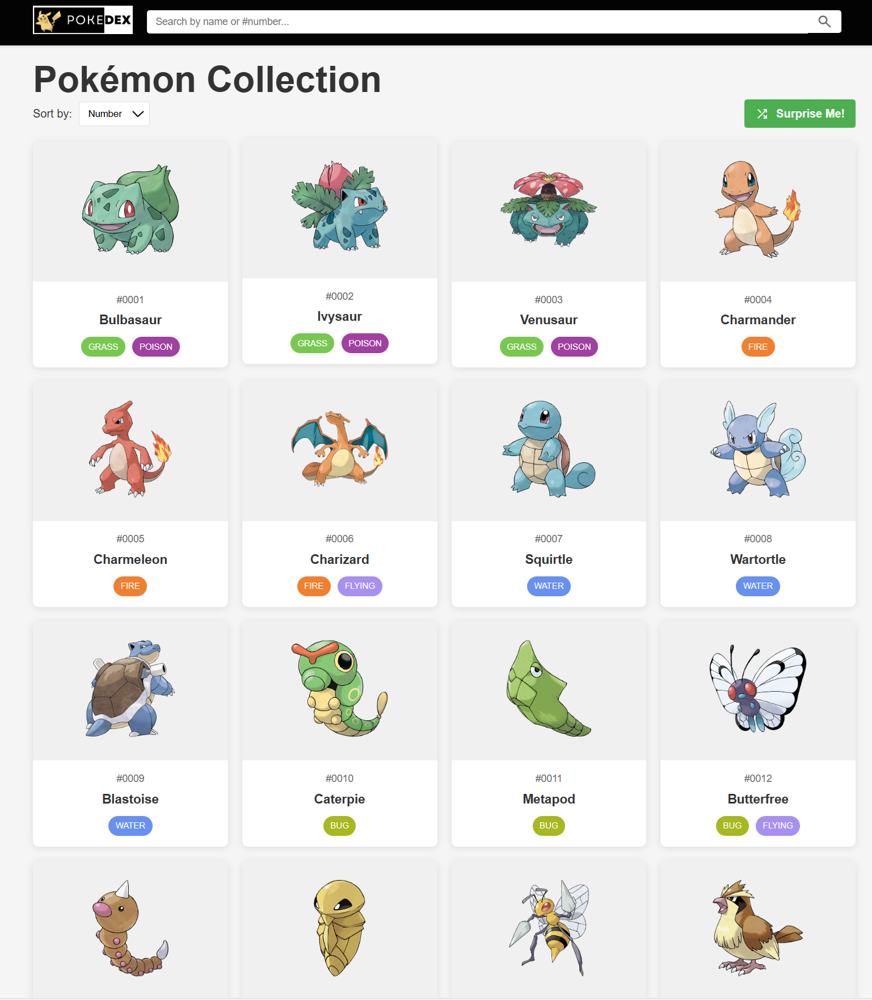
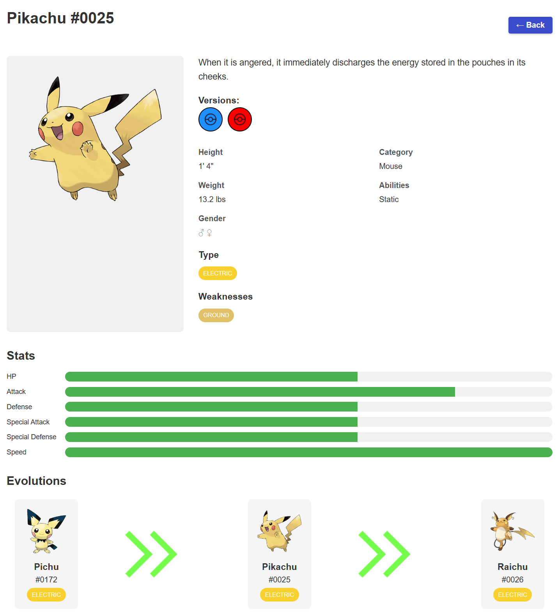

# Pokemons Project

A web application that displays Pokémon information, including their characteristics and evolution chains. This project is built with React and Vite.

## Demo
https://falibo.github.io/Pokemons/

## Snapshots

*Home page displaying the Pokémon list*


*Detailed view of a selected Pokémon*


## Features

- Browse all Pokémon with their detailed information
- Search functionality to find specific Pokémon by name or number
- Sort and filter controls to organize the Pokémon list
- Detailed view for each Pokémon showing characteristics and evolution chains
- Responsive design for both desktop and mobile devices

## Technologies Used

- React.js
- Vite
- JavaScript/JSX
- CSS
- Local data storage (data.js)

## Project Structure

```
/src              - Source files
  /components     - React components
    Navbar.jsx    - Navigation bar component
    PokemonCard.jsx - Individual Pokémon card display
    PokemonList.jsx - List of all Pokémon cards
    SearchBar.jsx  - Search functionality
    SortControls.jsx - Controls for sorting Pokémon list
  /db
    data.js       - Hard-coded Pokémon database
  /pages
    DetailPage.jsx - Individual Pokémon details page
    Home.jsx      - Home page with Pokémon listing
  App.css         - Main application styles
  App.jsx         - Main application component
  index.css       - Global styles
  main.jsx        - Entry point
```

## Prerequisites

- Node.js (version 16.x or higher recommended)
- npm or yarn

## Installation

Clone the repository:

```bash
git clone https://github.com/yourusername/pokedex-project.git
cd pokedex-project
```

Install dependencies:

```bash
npm install
# or if you use yarn
yarn
```

## Running the Development Server

To start the development server:

```bash
npm run dev
# or if you use yarn
yarn dev
```

This will start the development server at `http://localhost:5173` (Vite's default port).

## Building for Production

To build the app for production:

```bash
npm run build
# or
yarn build
```

This will generate a `dist` folder with production-ready files.

## Future Improvements

- Adding a section for Pokémon snapshots/images
- Implementing local storage for saved favorites
- Adding more detailed evolution chains
- Implementing responsive image optimization

## Contributing

Contributions are welcome! Please feel free to submit a Pull Request.

## License

This project is licensed under the MIT License - see the LICENSE file for details.
